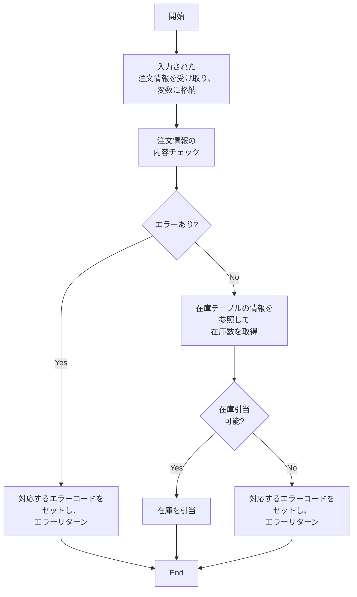
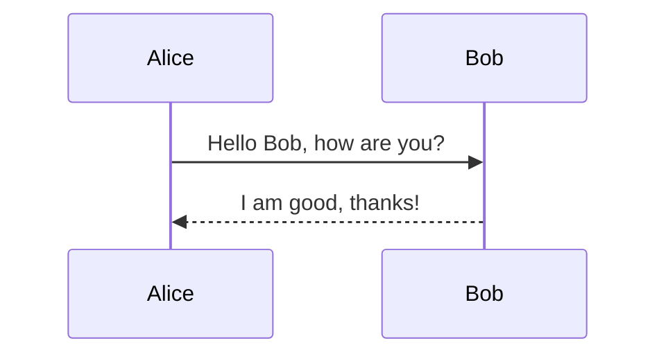
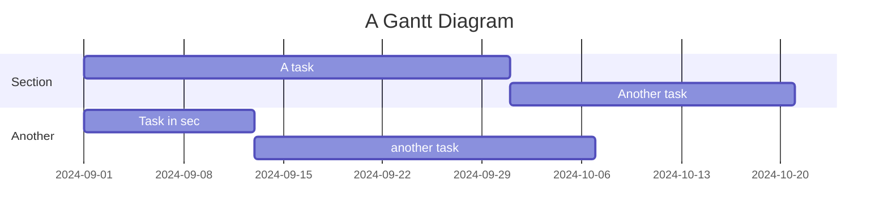
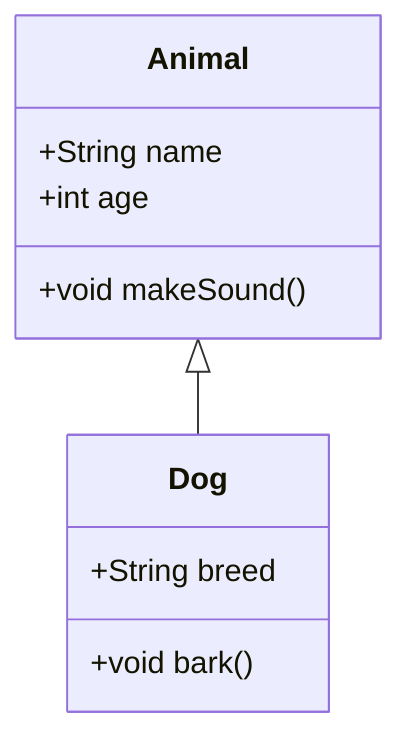
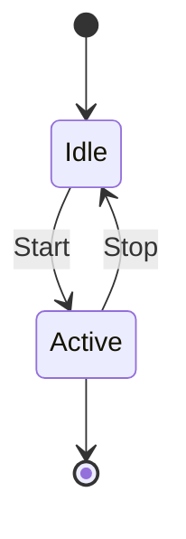
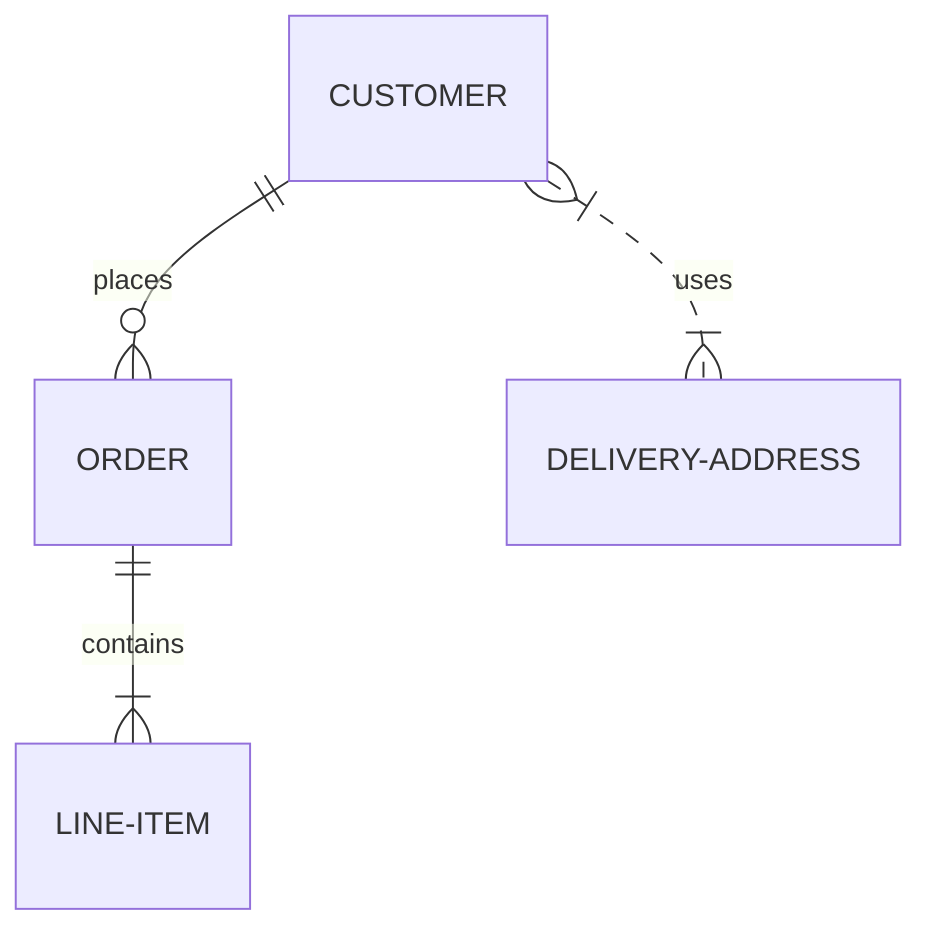
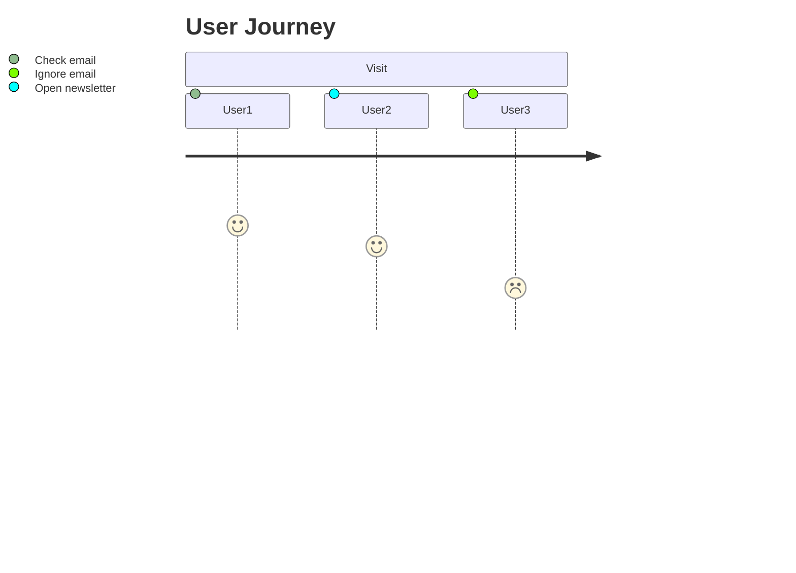

修正中 24-08-17

# マークダウン記法メモ

__以下Mermeidコードを使う方法__

- フローチャート

```mermaid
graph TD;
    A[開始] --> B[入力された<br>注文情報を受け取り、<br>変数に格納];
    B --> C[注文情報の<br>内容チェック];
    C --> D{エラーあり?};
    D -->|Yes| E[対応するエラーコードを<br>セットし、<br>エラーリターン]
    D -->|No| F[在庫テーブルの情報を<br>参照して<br>在庫数を取得];
    F --> G{在庫引当<br>可能?};
    G -->|Yes| H[在庫を引当];
    G -->|No| I[対応するエラーコードを<br>セットし、<br>エラーリターン];
    E --> J[End];
    H --> J
    I --> J
```

- シーケンス図

```mermaid
sequenceDiagram
    participant Alice
    participant Bob
    Alice->>Bob: Hello Bob, how are you?
    Bob-->>Alice: I am good, thanks!
```

- ガントチャート

```mermaid
gantt
    title A Gantt Diagram
    dateFormat  YYYY-MM-DD
    section Section
    A task           :a1, 2024-09-01, 30d
    Another task     :after a1  , 20d
    section Another
    Task in sec      :2024-09-01  , 12d
    another task     : 24d
```

- クラス図

```mermaid
classDiagram
    class Animal {
      +String name
      +int age
      +void makeSound()
    }
    class Dog {
      +String breed
      +void bark()
    }
    Animal <|-- Dog
```

- 状態図

```mermaid
stateDiagram-v2
    [*] --> Idle
    Idle --> Active : Start
    Active --> Idle : Stop
    Active --> [*]
```

- ER図 (Entity Relationship Diagram)

```mermaid
erDiagram
    CUSTOMER ||--o{ ORDER : places
    ORDER ||--|{ LINE-ITEM : contains
    CUSTOMER }|..|{ DELIVERY-ADDRESS : uses
```

- ジャーニー図 (User Journey)

```mermaid
journey
    title User Journey
    section Visit
      User1: 5: Check email
      User2: 4: Open newsletter
      User3: 2: Ignore email
```

